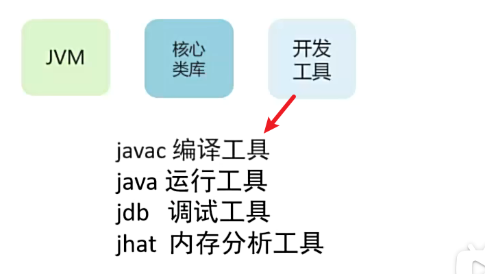
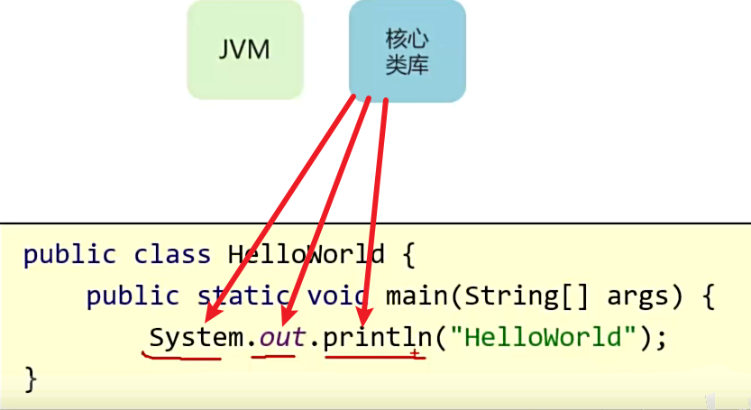
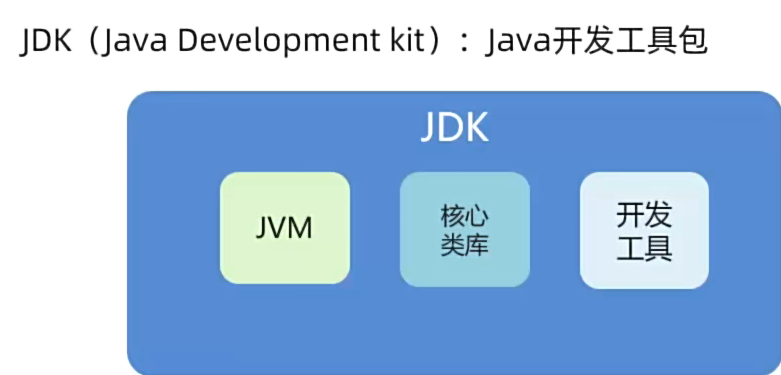
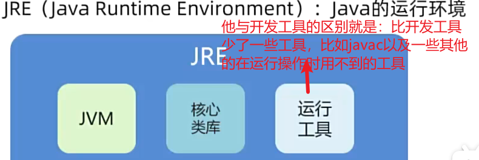
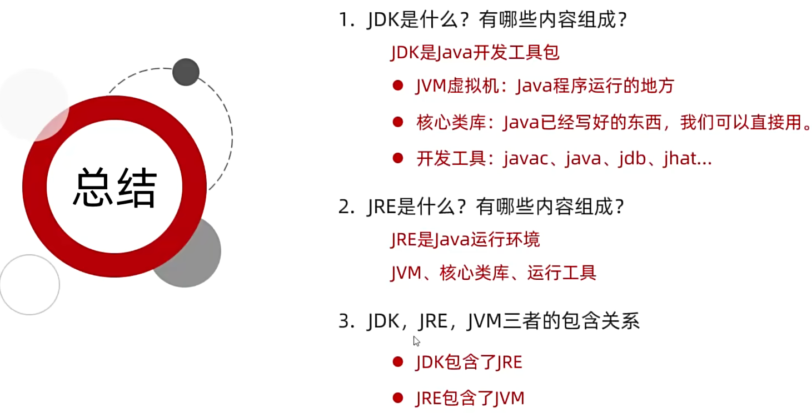

#### 一、Java语言类型

Java跨平台的原理:虚拟机,一次编译,到处运行.

**Java即是编译型语言也是解释性语言**.

> 举例:C语言是编译型语言-在运行前会先生成一个字节码文件,然后再在电脑上面运行-不具备跨平台
>
> ​       Python语言是解释性语言-不会生成字节码文件,直接一行一行的读取并在机器上面运行-不具备跨平台
>
> ​       Java语言是混合性-运行前会生成一个字节码文件,然后在虚拟机上面运行的时候,字节码文件一行一行的读取再运行-因为不是直接运行在电脑上的,是运行在虚拟机上面的,所以具备快平台性

#### 二、JDK和JRE的区别

##### 2.1、JDK中包含的各部分

###### 1、开发工具

###### 2、核心类库

> 指这些提前已经写好的可以直接用的类

###### 3、JVM

> JVM虚拟机，是Java语言跨平台的根本，同时也是字节码文件直接运行的场所。

###### 4、JDK

###### 5、JRE

###### 6、总结

-----

#### 三、注释

>  Java中注释的类别:

----

#### 四、变量类型

