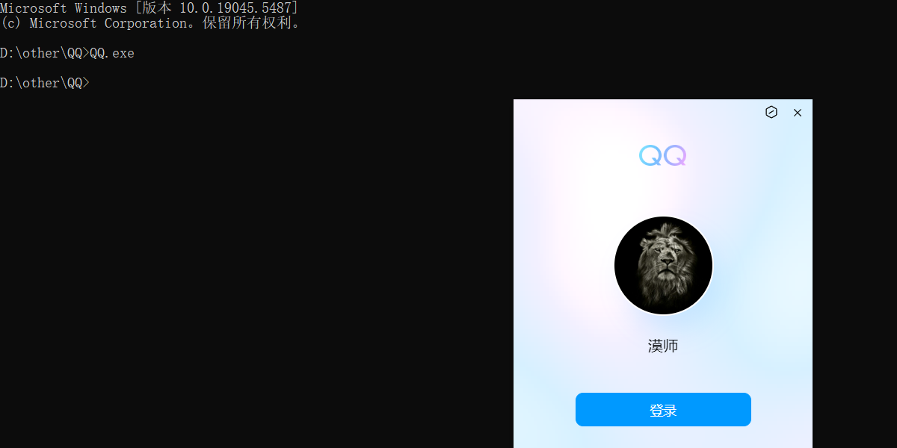
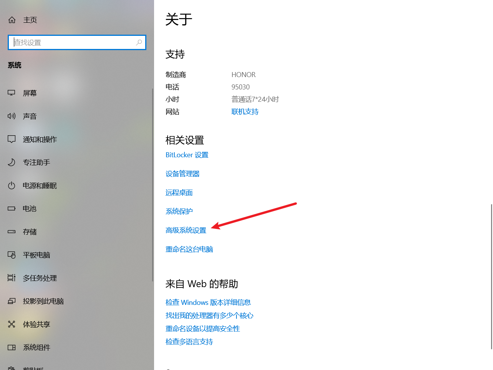
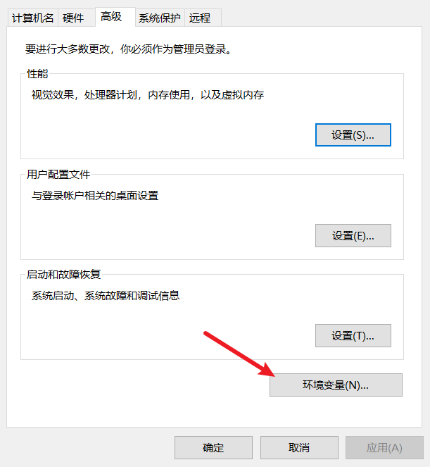
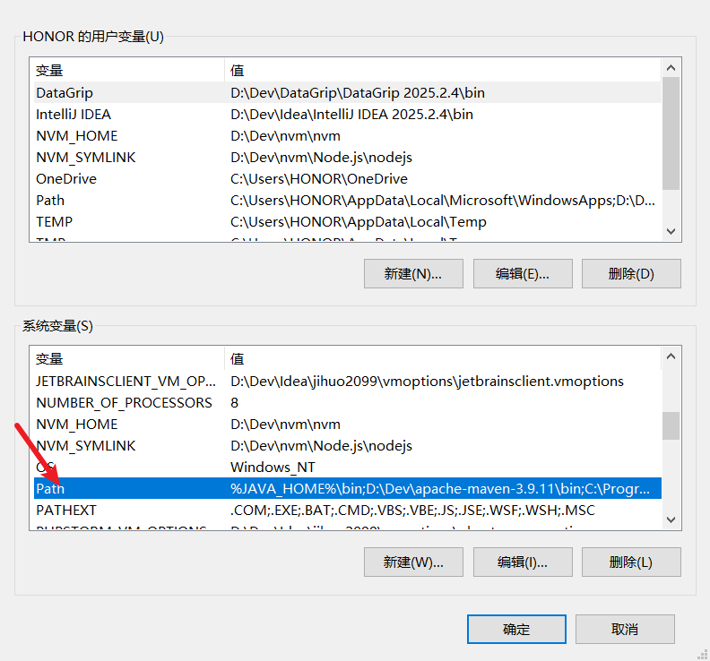
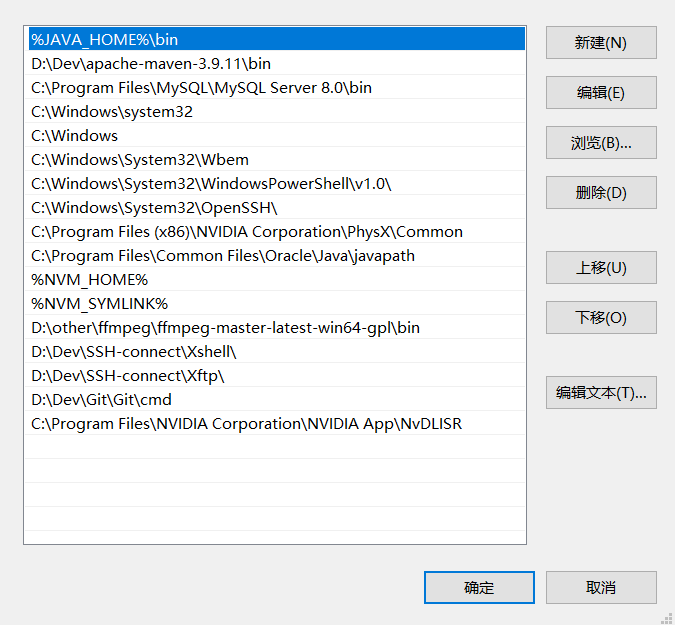

# 为什么要配置环境变量

举例说明：

> 我们只有在该应用的可执行文件所在的目录下进入命令行页面输入可执行文件的名称（如：QQ.exe）即可启动该应用，
>
> ​     但是这样就太麻烦了，我们可以直接把该路径配置到环境变量中(电脑首先会现在环境变量中查找)，这样的话我们在任何的目录下的命令行窗口中都能够通过输入QQ.exe，来打开该应用。
>
> ​     总结：环境变量就相当于小区中的所有门牌号所对应的户主的信息，通过这个环境变量我们就能够知道我们要找的人在几楼几层门牌号是多少！

# 配置环境变量步骤

1. 
2. 
3. 
4. 
5. **注意：我们一般选择系统变量而不选择用户变量，因为用户变量的配置只对当前的HONOR用户生效，而系统变量的配置则对所有的用户都生效**
6. 