> 计算机中的二进制存储计算是使用的**补码**，其中的原码、反码是辅助理解的概念！

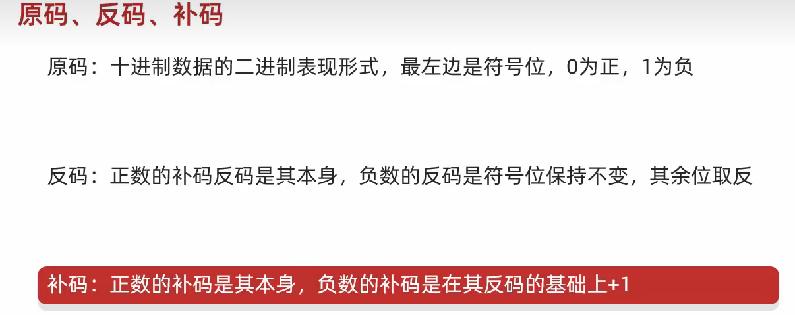

##### 一、源码

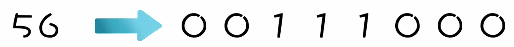

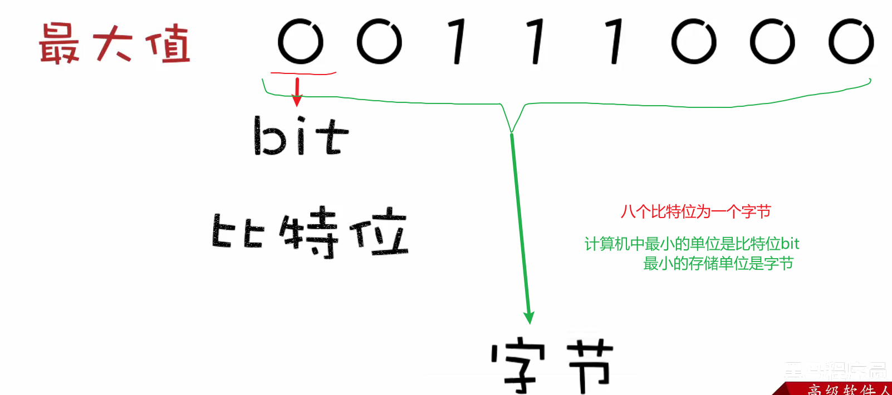

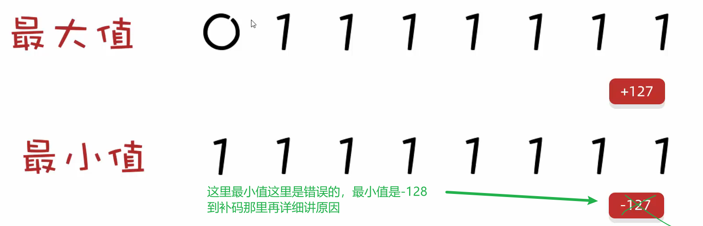

###### 1.1、原码弊端

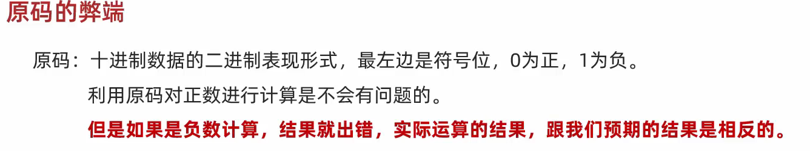

##### 二、反码

> 在原码的基础上，**符号为不变，其余数值取反：0变1,1变0.**

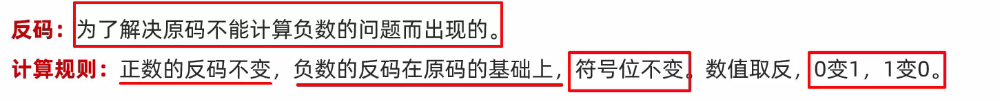

###### 2.1、反码弊端

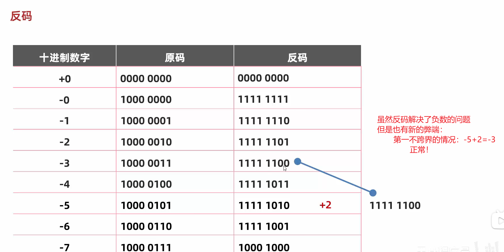

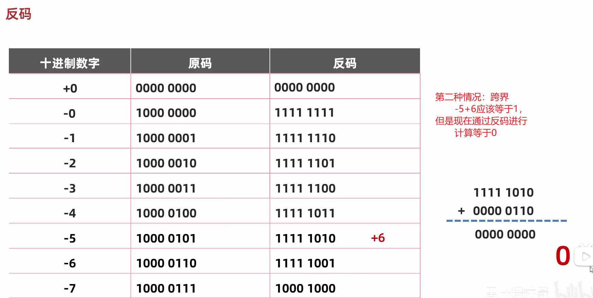

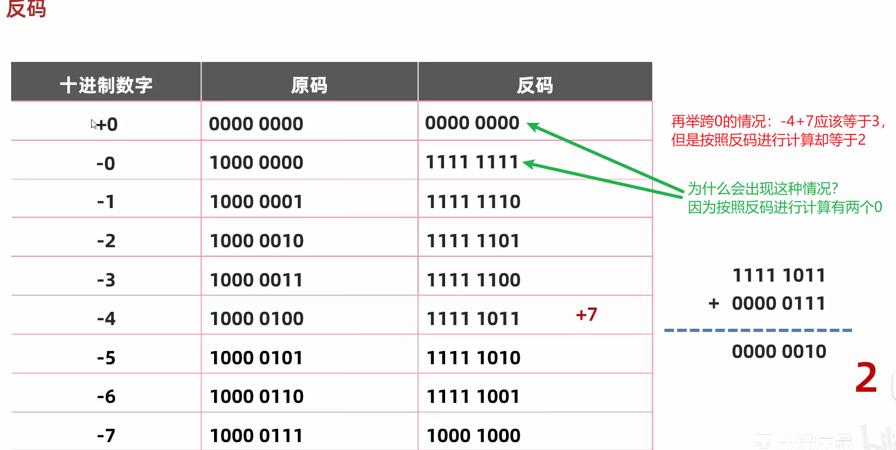

##### 三、补码

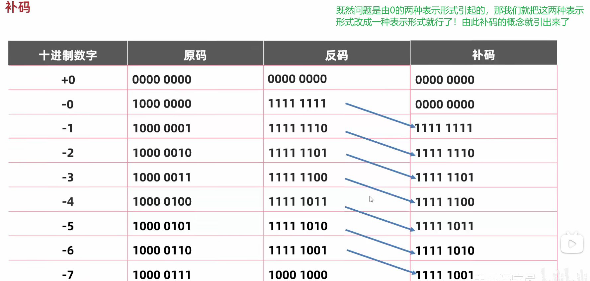

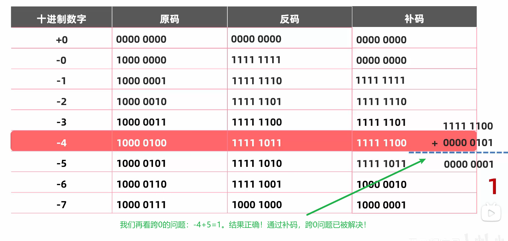

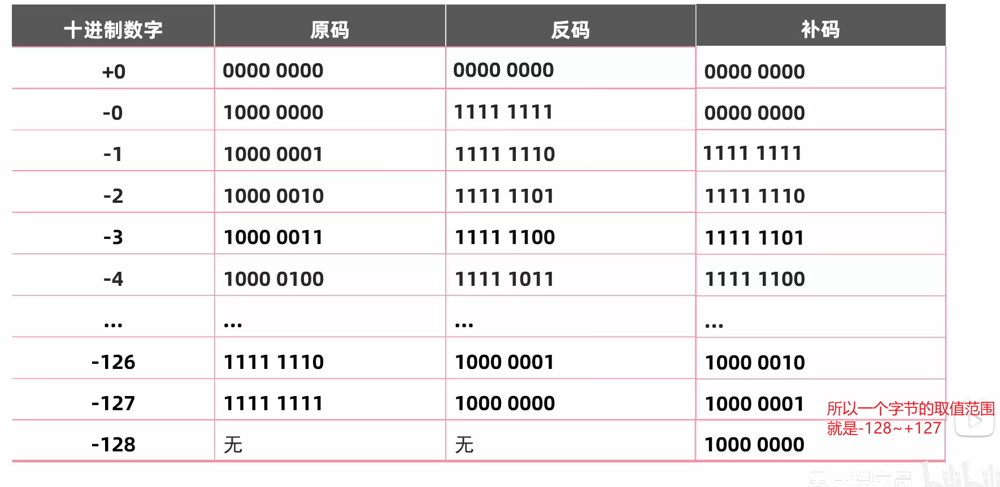

##### 四、小结

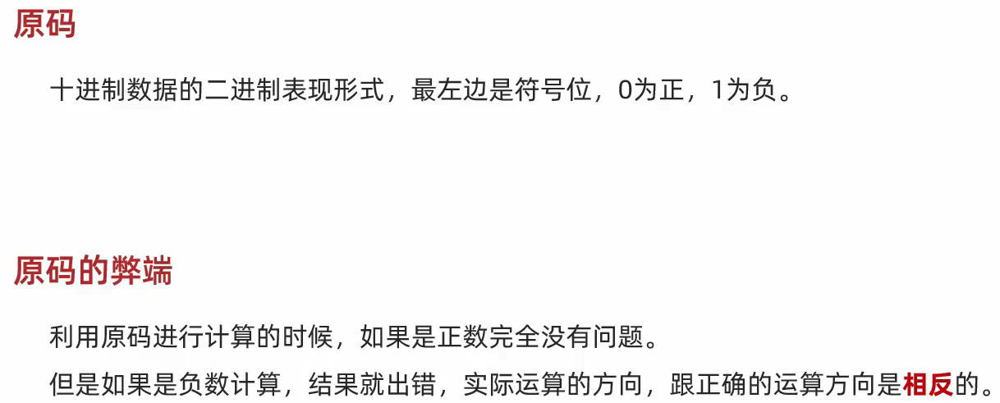

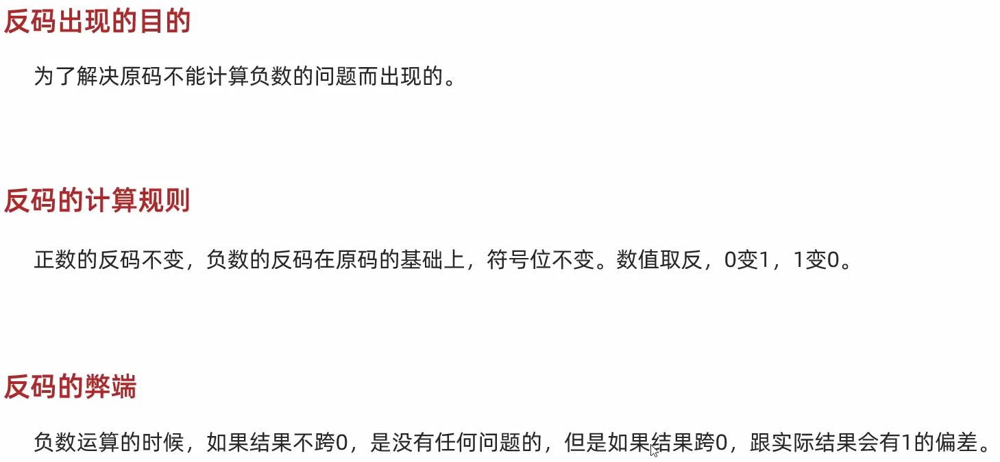

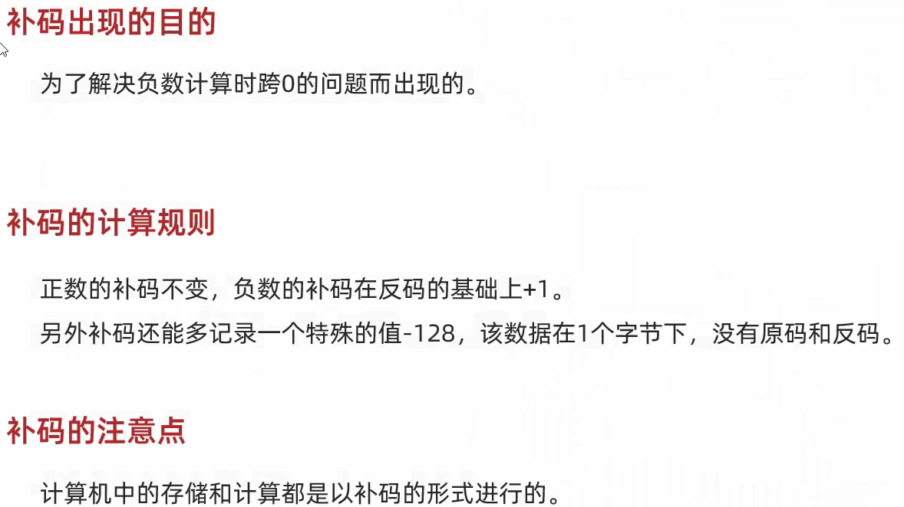

##### 五、拓展

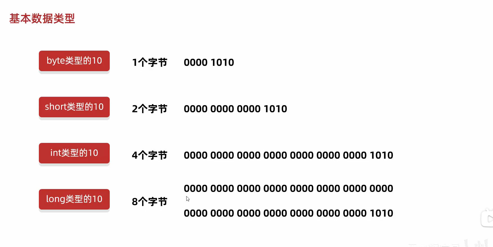

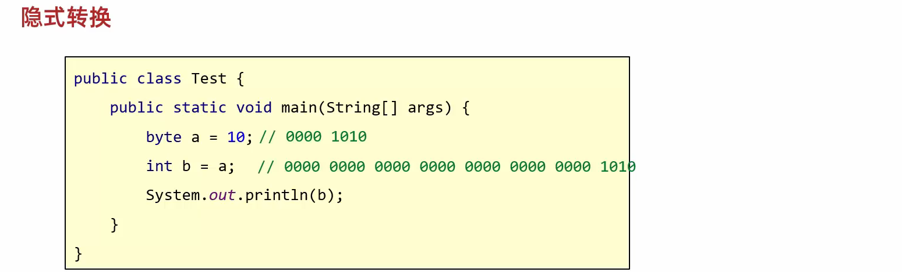

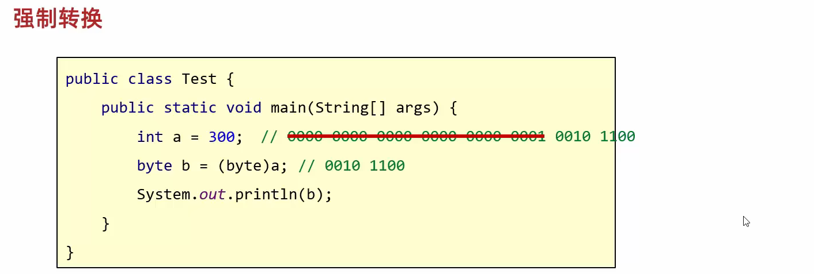

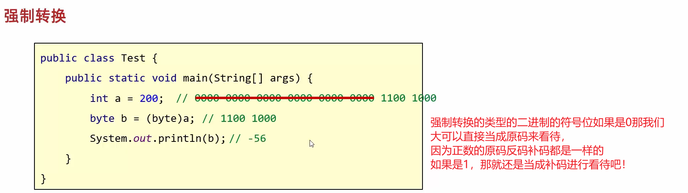

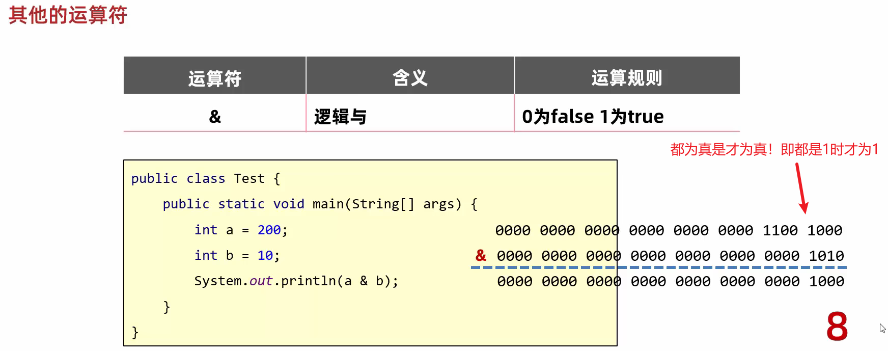

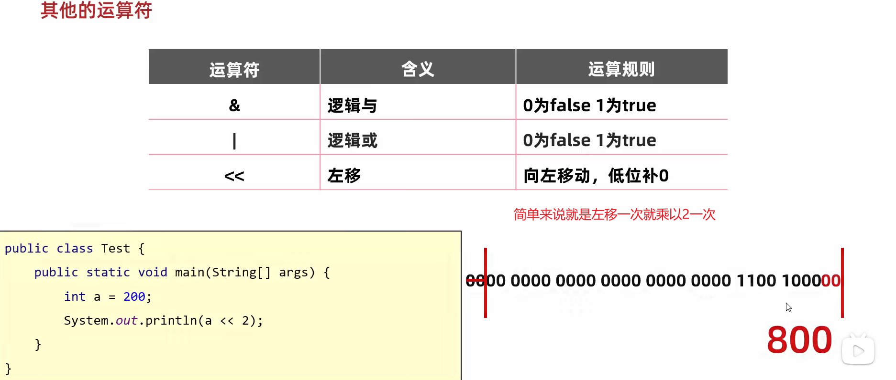

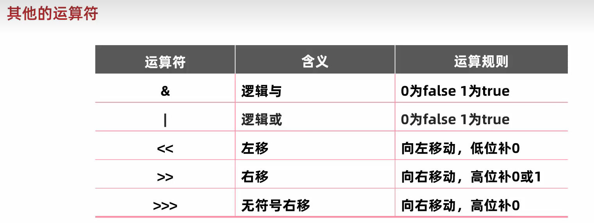

