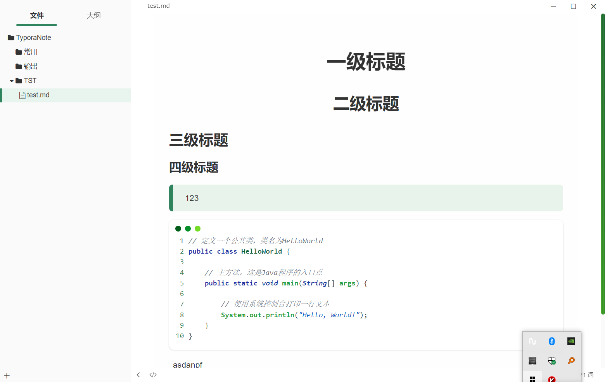

# 一级标题

## 二级标题

### 三级标题

#### 四级标题

> 123

~~~java
// 定义一个公共类，类名为HelloWorld
public class HelloWorld {

    // 主方法，这是Java程序的入口点
    public static void main(String[] args) {
        
        // 使用系统控制台打印一行文本
        System.out.println("Hello, World!");
    }
}
~~~

asdanpf

​					
