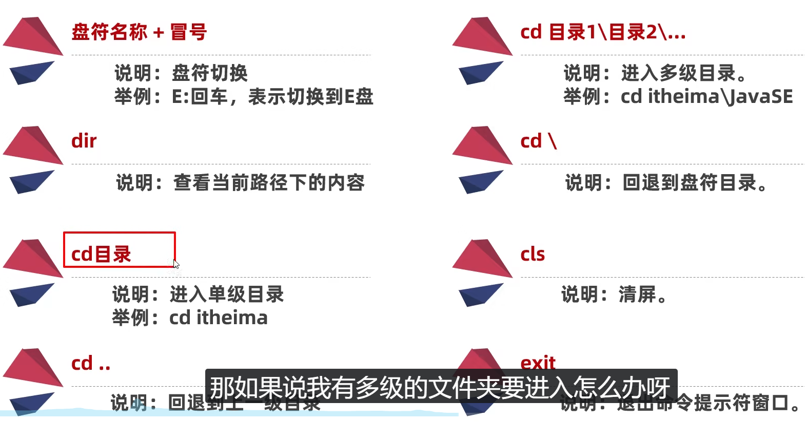

1. Win + E ：快速打开文件夹
2. Alt + F4：退出程序（任何）
3. Alt + table：快速切换应用界面（不同应用之间）
4. Ctrl + table：快速切换页面（同一个浏览器内的页面）
5. Ctrl + T：新建一个浏览器页面
6. Ctrl + w：关闭当前浏览器页面
7. F ：将当前页面视频-变成全屏
8. Win + R：打开电脑的命令行窗口
9. 
10. Win + D：返回桌面-所有的程序以及浏览器页面都将会缩小到任务栏